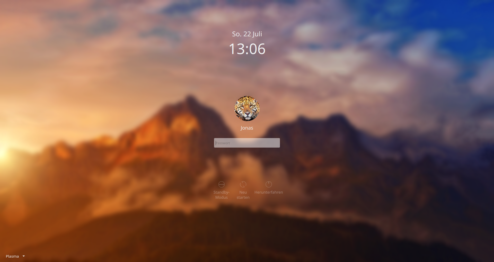

# JaguOS login theme for KDE Plasma

This is the default login theme for **JaguOS**. It is a bit like the macOS Login Theme, but even easier to use and with everything a login theme needs.

### Prerequisites

KDE Plasma 5

### Installing the theme

[Download the zip archive from GitHub](https://www.github.com/jonasjaguar/jaguos-login-theme/archive/master.zip) and extract the contents to the theme directory of the SDDM manager (change the path for the downloaded file if necessary):
```
$ sudo unzip ~/Downloads/master.zip -d /usr/share/sddm/themes/jaguos-login
```
This will extract all the files to a folder called jaguos-login inside of the themes directory of SDDM. After that you will have to point SDDM to the new theme by editing its config file:
```
$ sudo nano /usr/lib/sddm/sddm.conf.d/sddm.conf
```
In the `[Theme]` section set `Current=jaguos-login`. For a more detailed description please refer to the [Arch wiki on sddm](https://wiki.archlinux.org/index.php/SDDM). Note that, depending on your system setup, a duplicate configuration may exist in `/etc/sddm.conf`. Usually, this path takes preference so you want to set the above line in this file if you have it.

### Theming the theme

The JaguOS Login Theme is now customizable through its `theme.conf` file. You can now alter the intensity of the background blur or even not have any blur at all! Also, there may be screens so big that the avatar just not looks correct. Change it in the config to something that better suits your screen!

  * Change the path of the background image relative to the themes directory:
  `background=components/artwork/background.jpg`

  * Disable blur or play around with its intensity:
  `blur=true`
  `recursiveBlurLoops=40`
  `recursiveBlurRadius=4`

  * Adjust the size of the user image:
  `changeAvatarPixelSize=`

You might see some grey pixels around your user image which is caused by the anti-aliasing of the opacity mask. You may change the fill colour of the mask that resides in `components/artwork/mask.svg` to a colour that better matches with your user images colours. Do **not** change the *opacity* of the mask. Take note that this might affect other user images with different colours present on your system.

### License

This project is licensed under the GPLv3 License - see the [LICENSE](LICENSE.md) for details

### Acknowledgments

The original code is taken from KDE plasmas breeze theme. In specific the SDDM login theme written by [David Edmundson](davidedmundson@kde.org).
